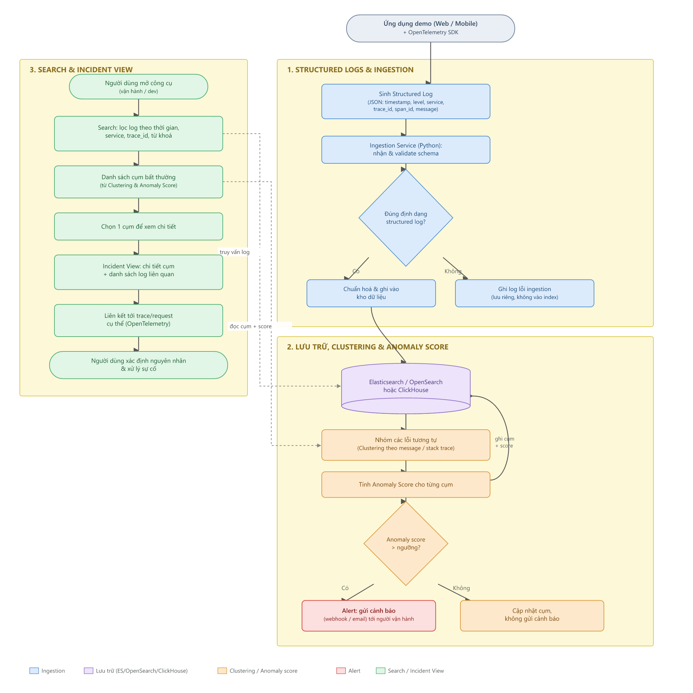

# Log Anomaly Explorer

Thu thập log từ ứng dụng demo, nhóm các lỗi tương tự, phát hiện bất thường, và liên kết bất thường về trace/request cụ thể đã gây ra nó.

**Đề tài:** AI-06 · **Nhóm:** SE2026-T04

## MVP

Structured logs · Ingestion · Search · Clustering/anomaly score · Alert · Incident view

## Công nghệ

OpenTelemetry (instrumentation) · Python (toàn bộ service) · Elasticsearch/OpenSearch **hoặc** ClickHouse (chọn một, xem `ingestion/README.md`)

## Kiến trúc



3 luồng chính: **(1)** demo-app sinh structured log có `trace_id` → ingestion validate & lưu trữ; **(2)** job nền nhóm lỗi tương tự, tính anomaly score, phát alert khi vượt ngưỡng; **(3)** search tra cứu log thô theo field, incident view hiển thị chi tiết cụm kèm trace/request liên quan.

## Cấu trúc thư mục & phân công

| Thư mục | Phụ trách | MVP | GitHub evidence |
|---|---|---|---|
| [`demo-app/`](demo-app/) | Mạnh | Structured logs | Fault injection |
| [`ingestion/`](ingestion/) | Minh | Ingestion | Load test (ingestion) |
| [`clustering/`](clustering/) | Nam | Clustering/anomaly score, Alert | Labeled incidents, Precision/recall |
| [`query-api/`](query-api/) | Nghĩa (nhóm trưởng) | Search, Incident view | Runbook, Load test (end-to-end) |
| [`load-tests/`](load-tests/) | Minh + Nghĩa (dùng chung) | — | Load test |
| [`docs/`](docs/) | Cả nhóm | — | — |

Mỗi module có `README.md` riêng ghi rõ: việc cần làm (checklist), hợp đồng dữ liệu đang tuân theo, cách chạy thử, evidence sở hữu.

## Cấu trúc dữ liệu (đổi phải báo cả nhóm)

- [`docs/architect/contracts/log-schema.json`](docs/architect/contracts/log-schema.json) — định dạng structured log (demo-app → ingestion)
- [`docs/architect/contracts/cluster-record.schema.json`](docs/architect/contracts/cluster-record.schema.json) — định dạng cụm + anomaly score (clustering → query-api)
- [`docs/architect/contracts/api-contract.md`](docs/architect/contracts/api-contract.md) — endpoint `/ingest`, `/search`, `/clusters`, `/clusters/{id}`


## Bắt đầu nhanh (từng module)

Mỗi module tự quản lý `requirements.txt` riêng:

```bash
# Ví dụ: chạy ingestion
cd ingestion
pip install -r requirements.txt
uvicorn src.main:app --reload --port 8000
```

Xem `README.md` trong mỗi thư mục để biết cổng (port) và cách chạy cụ thể.

## GitHub evidence bắt buộc

| Evidence | Vị trí | Phụ trách |
|---|---|---|
| Fault injection | `demo-app/src/main.py` (`/simulate-error`) | Mạnh |
| Labeled incidents | `clustering/evaluation/labeled_incidents.json` | Nam |
| Precision/recall | `clustering/evaluation/precision_recall.py` | Nam |
| Load test | `load-tests/` | Minh (ingestion), Nghĩa (end-to-end) |
| Runbook | `docs/task/runbook.md` | Nghĩa |

## Quy ước làm việc

1. Không sửa `docs/architect/contracts/` một mình — báo cả nhóm trước khi đổi.
2. Mỗi module làm trên nhánh riêng, PR vào `main`, nhóm trưởng (Nghĩa) review trước khi merge.
3. Trước khi code logic thật, mỗi module nên chạy được tối thiểu (`uvicorn ... --reload`) — khung đã dựng sẵn để đảm bảo điều này ngay từ đầu.
